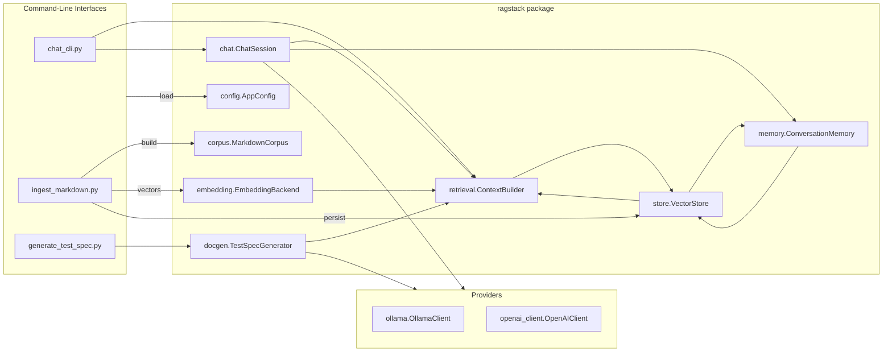
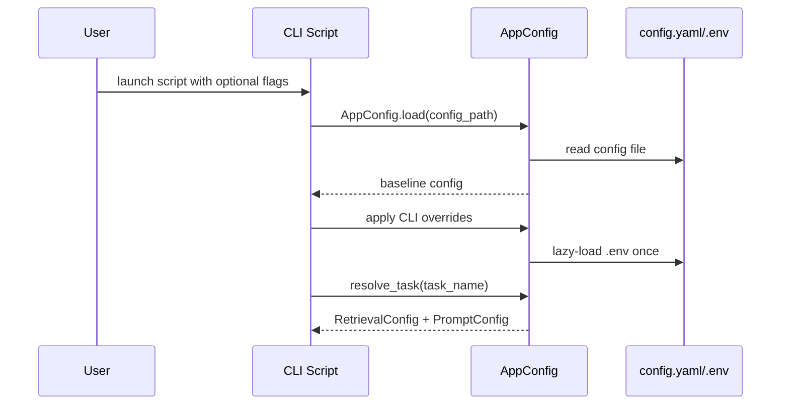
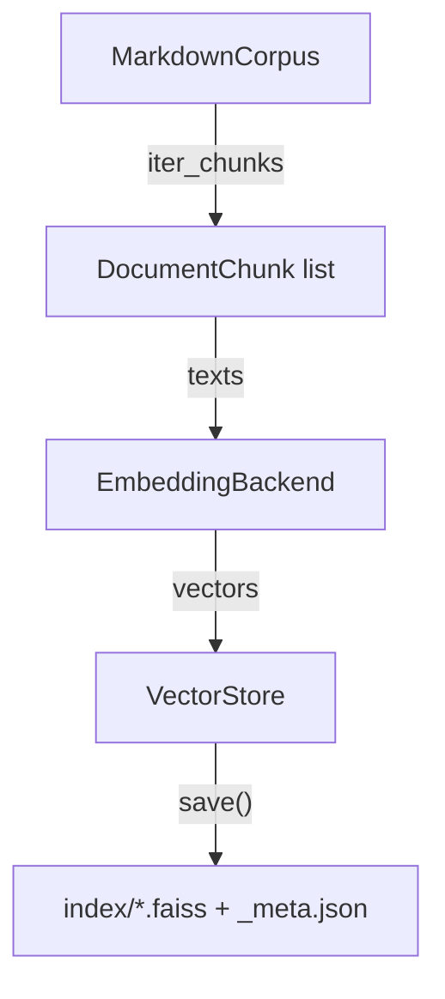
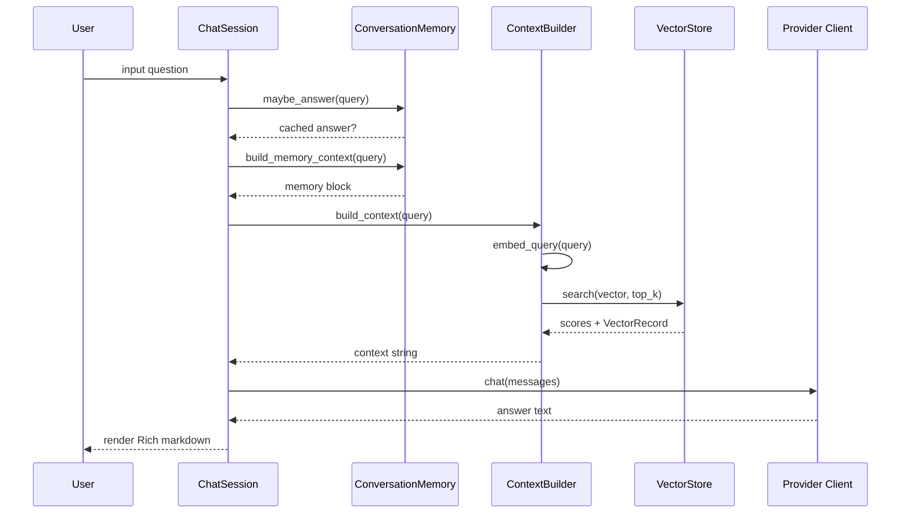

# RAG Stack Architecture Guide

This guide explains how Contextus implements retrieval-augmented generation (RAG) across ingestion, storage, and
large-language-model (LLM) orchestration layers. It highlights control flow, data dependencies, and the extension points that
allow different retrievers, vector stores, and chat providers to plug into the system.

## High-Level Component View

Each CLI is a thin adapter that parses overrides, loads configuration, and composes the reusable classes living in
`ragstack/`. Provider-specific integrations (Ollama and OpenAI) implement a shared protocol so chat and documentation
workflows remain provider-agnostic.

## Configuration System

Configuration is centralised in `ragstack/config.py`, which exposes dataclasses for corpus discovery, embeddings,
chunking, retrieval, vector store selection, persistent memory, provider credentials, prompts, and documentation settings.
`AppConfig.load()`
performs the following merge order:

1. Defaults baked into the dataclasses.
2. Overrides from `config.yaml` (or `config.json` for backwards compatibility).
3. Environment variables (optionally sourced from `.env` via `dotenv`).
4. Task profiles defined under `tasks:` that selectively override retrieval and prompt fields.

### Task Profiles and Runtime Overrides

Task profiles are named configurations that tweak retrieval or prompt behaviour without duplicating entire config files.
`AppConfig.resolve_task()` materialises the merged `RetrievalConfig` and `PromptConfig`, enabling CLIs to expose a `--task`
flag for persona-specific behaviour. Environment variables further override configuration at load time, allowing deployments
to change embedding models, device selection, retrieval depth, or provider credentials without editing YAML. The loader reads
a single `.env` file on first use to avoid repeated filesystem access in long-running processes.

## Ingestion Pipeline

`ingest_markdown.py` orchestrates offline ingestion. It instantiates an `IndexBuilder`, which executes:

1. `MarkdownCorpus.build()` enumerates documents under `config.paths.data_dir`, applies include/exclude globbing, optionally
   converts non-markdown formats via MarkItDown, strips markdown syntax, and yields overlapping chunks using `text.Chunker`.
2. `create_embeddings()` constructs the configured embedding backend (default: `SentenceTransformerEmbeddings`). Devices are
   auto-detected (`cuda`, `mps`, or `cpu`) unless overridden.
3. `EmbeddingBackend.embed_documents()` generates normalised embeddings for each chunk.
4. `create_vector_store()` instantiates the vector store backend (default: `FaissVectorStore`). The store persists vectors to
   `<index_name>.faiss` and metadata to `<index_name>_meta.json`.
5. The index is saved, returning `IngestionStats` with document, chunk, and dimension counts.

## Retrieval & Context Building

`ragstack/retrieval.py` converts the vector store into prompt-ready context blocks:

- `ContextBuilder.retrieve()` embeds a query, optionally re-embeds the top-N hits for reranking, and filters out low-scoring
  results before returning `VectorRecord` matches.
- Each hit is rendered as `[source: path#chunk | score: N.NNN]` plus the chunk text, concatenated with configurable
  separators.
- `ContextBuilder.build_context()` streams formatted chunks while respecting both character and token budgets, truncating the
  final chunk if needed to honour the configured limits.

This retrieval path is shared by chat and documentation generation, ensuring all downstream consumers are grounded in the
same indexed corpus.

### Context Window Management Strategies

- **Character Budgets:** `retrieval.max_context_chars` caps the assembled context string, providing a lightweight guardrail for
  LLM context windows regardless of provider limits.
- **Token Budgets:** `retrieval.max_context_tokens` pairs the character guardrail with tokenizer-aware estimates. The
  `TokenCounter` utility uses tiktoken when available (or a configurable char-per-token heuristic) and subtracts
  `retrieval.token_overhead` to reserve room for prompts and user turns.
- **Score Thresholds:** `retrieval.min_score` drops low-confidence chunks, keeping the remaining budget focused on relevant
  passages.
- **Reranking:** `retrieval.rerank_top_k` re-embeds the highest-ranking chunks and re-sorts them against the query vector to
  improve alignment when the base FAISS scores are noisy.
- **Task Profiles:** Profiles targeting long-form answers can increase `retrieval.top_k`, `max_context_chars`, or token budgets
  to push more evidence into prompts.

## Persistent Memory Layer

`ConversationMemory` (in `ragstack/memory.py`) augments retrieval with long-term recall and summarisation:

- **Episodic store:** Every `(query, answer)` pair is embedded with the configured `EmbeddingBackend` and written to a dedicated
  FAISS index identified by `MemoryConfig.index_name`.
- **Rolling summary:** A Markdown digest constrained by `memory.summary_tokens` keeps the most recent
  `memory.rolling_window` turns available across sessions, persisted next to the memory index.
- **Semantic cache:** When similarity exceeds `memory.cache_min_score` the stored answer is reused, bypassing the LLM while
  logging the turn as `Origin: cached` for auditing.
- **Budget sharing:** `ConversationMemory.build_memory_context()` consumes a configurable token/character budget before handing
  the remaining allowance to `ContextBuilder`, preventing prompt overflows.

Memory artefacts (`*_memory_context.faiss`, summary JSON, and append-only logs) live under `config.paths.index_dir`. Behaviour is
controlled via YAML, environment variables (`MEMORY_*`), or CLI flags such as `--enable-memory`, `--memory-max-tokens`, and
`--memory-top-k`.

## Chat Session Orchestration

`ChatSession` coordinates retrieval and provider interaction:

1. `ensure_model()` fetches the available models from the provider and prompts the user (via Rich tables or automatic selection
   in non-interactive shells) to choose one if not already configured.
2. `ConversationMemory` checks for a high-confidence match and can return cached answers immediately.
3. Otherwise, `ConversationMemory.build_memory_context()` contributes persistent summaries and episodic memories.
4. `ContextBuilder.build_context()` fills the remaining budget with document chunks.
5. The session materialises chat messages from `PromptConfig` templates and calls `client.chat()` on the configured provider.
6. Responses render via Rich Markdown panels, are persisted into the memory index, and rolled into the summary/log files.

## Documentation Generation Workflow

`generate_test_spec.py` reuses the same retrieval layer to produce structured test cases. `TestSpecGenerator.generate_test_case()`:

1. Formats a test case identifier using `DocumentationConfig` (e.g., `TC-001`).
2. Retrieves requirement context with `ContextBuilder`.
3. Builds a strict JSON schema prompt to elicit precondition/action/expected/postcondition fields plus referenced requirement IDs.
4. Parses the provider response into a `TestCase` dataclass and renders Markdown output, optionally embedding the raw JSON for auditing.

This approach enables repeatable documentation that traces back to the same knowledge base used for chat.

## Extensibility Hooks

- **Embeddings:** Register custom backends with `ragstack.embedding.register_embedding_backend("name", CustomEmbeddingBackend)`
  provided the class subclasses `EmbeddingBackend` and implements `embed_documents()`.
- **Vector Stores:** Implement the `VectorStore` abstract base class and register it with `ragstack.store.register_vector_store()`.
  Configuration can then set `vector_store.backend` to the registry key or dotted import path.
- **Providers:** Any provider that satisfies the `SupportsModels` protocol (list models, ensure model, chat) can slot into
  `ChatSession` and documentation tooling. Ollama and OpenAI are reference implementations.
- **Task Profiles:** Define named override bundles under `tasks:` in `config.yaml` to tune retrieval depth, context budgets, or
  prompt templates per downstream use case.

## Supporting Utilities

Several helper scripts provide diagnostics and visualisation:

- `inspect_index.py` prints FAISS index metadata, including consistency checks between vector counts and metadata entries.
- `inspect_neighbors.py` reconstructs vectors to display nearest neighbours for random anchors, aiding qualitative validation of the embedding space.
- `visualize_tsne.py` projects embeddings to 2D with t-SNE for exploratory analysis.

These utilities share the same `AppConfig` loading mechanism and benefit from the Rich console for readable output.
