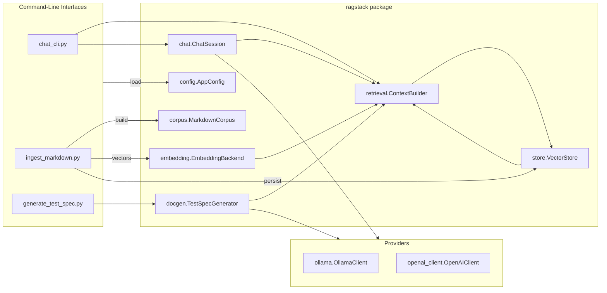
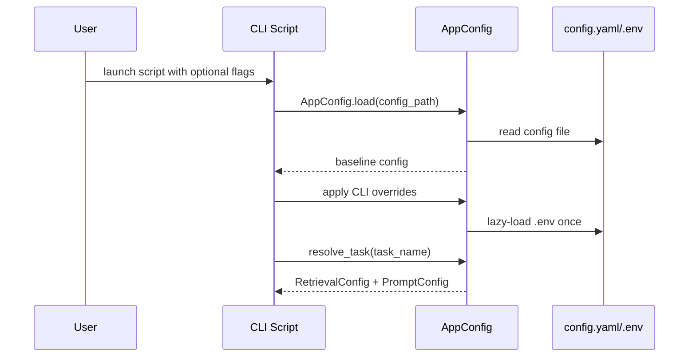
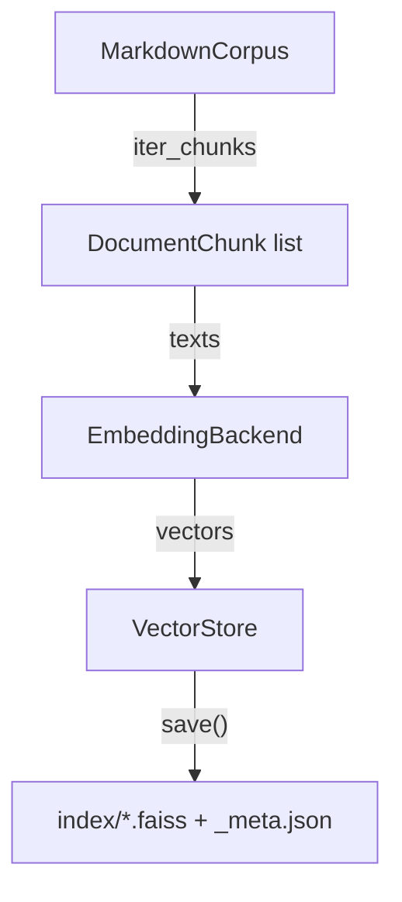
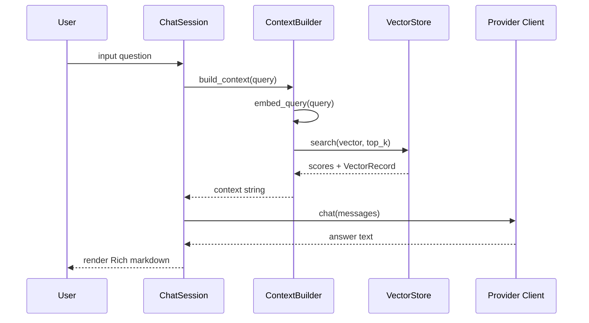

# Contextus Architecture

This document captures the structure, data flow, and extensibility points of the RAG Stack project. It is intended for engineers who need to understand how ingestion, retrieval, large language model (LLM) integration, and documentation generation are orchestrated across the codebase.

## High-Level Component View

The CLIs are thin entry points that parse overrides, load configuration, and compose the reusable classes living in `ragstack/`. Provider-specific integrations (Ollama and OpenAI) implement a shared protocol so the chat and documentation workflows remain provider-agnostic.

## Configuration System

Configuration is centralised in `ragstack/config.py`, which exposes dataclasses for corpus discovery, embeddings, chunking, retrieval, vector store selection, provider credentials, prompts, and documentation settings. `AppConfig.load()` merges:

1. Defaults baked into the dataclasses.
2. Overrides from `config.yaml` (or `config.json` for backwards compatibility).
3. Environment variables (optionally sourced from `.env` via `dotenv`).
4. Task profiles defined in the `tasks:` section, which can override retrieval and prompt fields per downstream use case.

### Task Profiles

Task profiles are named configurations that modify retrieval and prompt behaviour without duplicating entire config files. Each profile is turned into a `TaskProfile` object, and `AppConfig.resolve_task()` materialises the merged `RetrievalConfig` and `PromptConfig`. This mechanism powers the `--task` flag exposed by both `chat_cli.py` and `generate_test_spec.py`.

## Ingestion Pipeline

`ingest_markdown.py` drives the ingestion workflow. It instantiates an `IndexBuilder`, which performs the following steps:

1. `MarkdownCorpus.build()` enumerates documents under `config.paths.data_dir`, applies include/exclude globbing, optionally converts non-markdown formats via MarkItDown, strips markdown syntax, and yields overlapping chunks using `text.Chunker`.
2. `create_embeddings()` constructs the configured embedding backend (default: `SentenceTransformerEmbeddings`). Devices are auto-detected (`cuda`, `mps`, or `cpu`) unless overridden.
3. `EmbeddingBackend.embed_documents()` generates normalised embeddings for each chunk.
4. `create_vector_store()` instantiates the configured vector store backend (default: `FaissVectorStore`). The store persists vectors to `<index_name>.faiss` and metadata to `<index_name>_meta.json`.
5. The index is saved, returning `IngestionStats` with document, chunk, and dimension counts.

## Retrieval & Context Building

`ragstack/retrieval.py` wraps the vector store and embeddings to produce formatted context blocks for prompts:

- `ContextBuilder.retrieve()` embeds a query and performs `store.search()` to obtain the top-K `VectorRecord` hits.
- Each hit is rendered as `[source: path#chunk | score: N.NNN]` plus the chunk text, and the blocks are concatenated with `---` separators up to a configurable character budget.

This retrieval path is shared by chat and documentation generation, ensuring both consumers are grounded in the same indexed corpus.

## Chat Session Orchestration

`ChatSession` coordinates retrieval and provider interaction:

1. `ensure_model()` fetches the available models from the provider and prompts the user (via Rich tables/prompts) to choose one if not already configured.
2. Each user query triggers `ContextBuilder.build_context()` to gather relevant chunks.
3. The session materialises chat messages from `PromptConfig` templates and calls `client.chat()` on the provider.
4. Responses are rendered using Rich Markdown panels for a polished console experience.

## Documentation Generation Workflow

`generate_test_spec.py` repurposes the same retrieval layer to produce structured test cases. `TestSpecGenerator.generate_test_case()`:

1. Formats a test case identifier using `DocumentationConfig` (e.g., `TC-001`).
2. Retrieves requirement context with `ContextBuilder`.
3. Builds a strict JSON schema prompt to elicit precondition/action/expected/postcondition fields plus referenced requirement IDs.
4. Parses the provider response into a `TestCase` dataclass and renders Markdown output, optionally embedding the raw JSON for auditing.

This approach enables repeatable documentation that traces back to the same knowledge base used for chat.

## Extensibility Hooks

- **Embeddings:** Register custom backends with `ragstack.embedding.register_embedding_backend("name", CustomEmbeddingBackend)` provided the class subclasses `EmbeddingBackend` and implements `embed_documents()`.
- **Vector Stores:** Implement the `VectorStore` abstract base class and register it with `ragstack.store.register_vector_store()`. Configuration can then set `vector_store.backend` to the registry key or dotted import path.
- **Providers:** Any provider that satisfies the `SupportsModels` protocol (list models, ensure model, chat) can slot into `ChatSession` and `TestSpecGenerator`. Ollama and OpenAI are reference implementations.
- **Task Profiles:** Define named override bundles under `tasks:` in `config.yaml` to tune retrieval depth, context budgets, or prompt templates per downstream use case.

## Supporting Utilities

Several helper scripts provide diagnostics and visualisation:

- `inspect_index.py` prints FAISS index metadata, including consistency checks between vector counts and metadata entries.
- `inspect_neighbors.py` reconstructs vectors to display nearest neighbours for random anchors, aiding qualitative validation of the embedding space.
- `visualize_tsne.py` projects embeddings to 2D with t-SNE for exploratory analysis.

These utilities share the same `AppConfig` loading mechanism and benefit from the Rich console for readable output.

## Operational Considerations

- **GPU Usage:** Embedding device selection honours `config.yaml`, environment variables, and CLI overrides. Auto-detection falls back to CPU if CUDA/MPS are unavailable.
- **Index Integrity:** FAISS metadata is persisted separately; load-time warnings highlight mismatches so chat/docgen flows can continue even when legacy indexes have incomplete metadata.
- **Secrets Management:** `.env` files (or environment variables) must provide `OPENAI_API_KEY` before the OpenAI client can initialise. Ollama host/timeout are likewise configurable via env or CLI flags.

---

With this architecture map, contributors can trace how data moves from raw documents to interactive chat responses and generated documentation, and where to extend or swap components to suit their deployment.